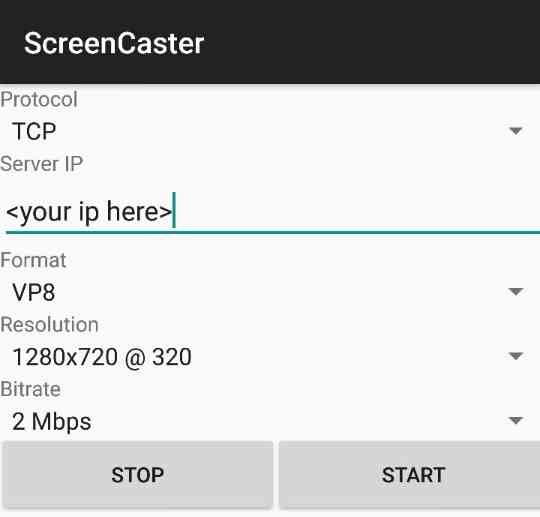

# AndroidScreenCaster
A live android screen caster which encoding media by h264,webm via TCP and UDP with low latency

# MOTIVATION
I'm currently in charge of test automation team. We try to make possible functional testing for mobile games. While we're working on it, we needed to mirror live android screen to web browser. The first approach was MJPEG. We captured entire screen and sent it over network in every very short period. Surely, it was ineffiecient, slow and huge. The first approach was helpful anyway to prove our concept of system, though.

The second approach was encoding our media data by using well known codecs such as h264 and vp8. It ended up a success anyway. However, it was hard to find code examples. I mostly refer to android googlesource(specially media test cases). I hope this project helps you to save your time and understand concept of live screen casting on Android.

# DEMO
[](https://www.youtube.com/watch?v=2AN6EfArfZE)

# TEST DEVICE
- Samsung Galaxy S7 edge (Android 6.0)

# REQUIREMENTS
- ffmpeg on server (demonstrating works well)

# SCREENSHOT


# QUICK START
## SERVER SIDE
- ```ffplay -framerate 60 -i tcp://<your server ip here>:49152?listen```

## CLIENT SIDE(THIS APP)
1. Put your remote host address(eg.IP)
2. Choose format as H.264
3. Tap Start
4. Do some other jobs to make ffmpeg receiving enough media data.

# SERVER SIDE FFMPEG COMMANDS
## PLAY
### TCP+H264
```ffplay -framerate 60 -i tcp://<your server ip here>:49152?listen```
### TCP+VP8
```ffplay -i tcp://<your server ip here>:49152?listen```
### UDP+H264
```ffplay -framerate 60 -i udp://@:49152```
### UDP+VP8
```ffplay -i udp://@:49152```

## RECORD
### UDP+H264
```ffmpeg -i udp://@:49152 -framerate 60 -codec:v libx264 -profile:v baseline -preset medium -b:v 250k -maxrate 250k -bufsize 500k -vf scale=-1:360 -an -threads 0 output.mp4```

#### if you need to make play speed faster. one more encode to output.mp4
```ffmpeg -i output.mp4 -vf "setpts=(1/2)*PTS" fast_output.mp4```


### UDP+VP8
```ffmpeg -i udp://@:49152 -c:v libvpx -b:v 1M -c:a libvorbis output.webm```


# Reference
- https://android.googlesource.com/platform/cts/+/lollipop-release/tests/tests/media/src/android/media/cts
- https://trac.ffmpeg.org/wiki/StreamingGuide
- https://trac.ffmpeg.org/wiki/Encode/VP8
- https://trac.ffmpeg.org/wiki/Encode/H.264

# License (MIT)
This project is licensed under the terms of the MIT license.
