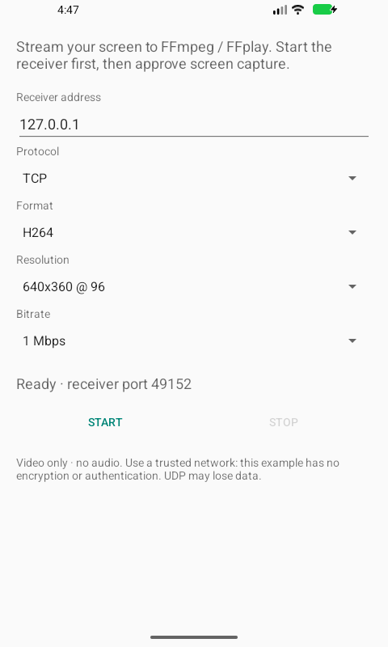

# AndroidScreenCaster

[](https://github.com/magicsih/AndroidScreenCaster/actions/workflows/android.yml)
[](https://github.com/magicsih/AndroidScreenCaster/releases)
[](LICENSE.md)

A Java **Android screen mirroring** example using **MediaProjection** for capture and **MediaCodec** for H.264 or VP8 encoding. It sends video over TCP or UDP to **FFmpeg / FFplay**, demonstrating the complete capture → encode → transmit path on Android 5.0 (API 21) and later, when a suitable Surface encoder is available.

## Demo

[](https://www.youtube.com/watch?v=2AN6EfArfZE)

Click the thumbnail to watch the original project demo on YouTube, recorded with an earlier version.

## Features

- TCP + H.264, TCP + VP8, UDP + H.264, UDP + VP8; fixed receiver port **49152**.
- H.264 uses a raw Annex B stream. VP8 uses **IVF**, not WebM.
- Video only: **no audio**. No custom server implementation or USB connection is required for Wi-Fi/LAN streaming.
- Each Start requests fresh Android screen-sharing consent. Stop in the app, notification, or system screen-sharing control ends the session.
- This is a developer example for **trusted networks**. The stream has no encryption or authentication; the receiver should bind only on a trusted interface and its firewall should restrict access.
- UDP is best effort: missing or reordered datagrams can corrupt video. Prefer TCP, especially for VP8/IVF.

## Install

Download the example **debug APK** and `SHA256SUMS` from [Releases](https://github.com/magicsih/AndroidScreenCaster/releases). Check the hash before installing:

```sh
# macOS
shasum -a 256 -c SHA256SUMS
# Linux
sha256sum -c SHA256SUMS
adb install -r AndroidScreenCaster-v0.2.0-debug.apk
```

Alternatively, transfer the APK to the phone and install it through Android's package installer. An APK built locally or in CI may have a different debug signature from a previous release. Do not uninstall an existing app just to bypass a signature error if you need its settings: build with its original signing key or use a separate test device.

## Build from source

Use **JDK 17**, Android SDK Platform **37.0**, and Build Tools **36.0.0**. The repository pins **AGP 9.4.1** and **Gradle 9.8.0** with a distribution checksum; it keeps Java and Groovy and has no runtime library dependencies.

```sh
git clone https://github.com/magicsih/AndroidScreenCaster.git
cd AndroidScreenCaster
# Set JAVA_HOME to your JDK 17 and ANDROID_HOME to your Android SDK.
sdkmanager 'platforms;android-37.0' 'build-tools;36.0.0'
./gradlew assembleDebug testDebugUnitTest lintDebug assembleDebugAndroidTest
adb install -r app/build/outputs/apk/debug/app-debug.apk
```

On Windows, use `gradlew.bat`. Android Studio can open the repository directly; set the Gradle JDK to 17. `minSdk` remains 21, `compileSdk` and `targetSdk` are 37, and the package remains `com.github.magicsih.androidscreencaster`.

## First stream

1. Install FFmpeg on a computer and put the computer and phone on a network that allows them to communicate. Find the computer's LAN IP address, for example `192.168.1.10`.
2. On the computer, start the receiver **before** capture:

   ```sh
   ffplay -f h264 'tcp://0.0.0.0:49152?listen=1'
   ```

3. In ScreenCaster, enter the **computer's address**, select **TCP**, **H264**, and a resolution/bitrate. For an initial check, try **640×360** and **1 Mbps**.
4. Tap **Start**. On Android 17+, allow local network access. Approve Android screen sharing; select **entire screen** if you want to switch between apps.
5. Open an app or move something on screen. FFplay should show the captured video. Tap **Stop** to disconnect. Start the receiver again before the next TCP session.

Allow incoming traffic on port 49152 for the selected protocol. Guest Wi-Fi, access-point client isolation, VPNs, and firewalls can block the connection even when both devices have internet access. Do not expose the receiver port to the public internet.

## FFplay commands

Use one receiver at a time. Quote the URLs so your shell does not interpret `?` or `&`.

| App settings | Receiver command |
| --- | --- |
| TCP / H264 | `ffplay -f h264 'tcp://0.0.0.0:49152?listen=1'` |
| TCP / VP8 | `ffplay -f ivf 'tcp://0.0.0.0:49152?listen=1'` |
| UDP / H264 | `ffplay -f h264 'udp://@:49152?fifo_size=65536'` |
| UDP / VP8 | `ffplay -f ivf 'udp://@:49152?fifo_size=65536'` |

UDP receivers must be listening before capture starts, so they receive the initial codec/container header. IVF carries microsecond presentation timestamps. With FFmpeg output, use `-fps_mode passthrough` to retain the received frame timing instead of synthesizing a constant frame rate.

To record H.264 over TCP without re-encoding:

```sh
ffmpeg -f h264 -i 'tcp://0.0.0.0:49152?listen=1' -an -c:v copy capture.mkv
```

To save the VP8 IVF stream:

```sh
ffmpeg -f ivf -i 'tcp://0.0.0.0:49152?listen=1' -an -c:v copy -fps_mode passthrough capture.ivf
```

## What is verified

See [the validation report](docs/VALIDATION.md) for exact Android versions, codec names, decoded frame counts, lifecycle tests, and remaining limits. CI verifies the build, unit tests, lint, and device-test APK compilation. Runtime and decoded-video checks are recorded separately; a green build alone does not establish streaming behavior. No end-to-end latency claim is made.



The screenshot is an API 37 emulator at 480×800. Its `127.0.0.1` receiver address uses the optional ADB forwarding setup below.

## Optional browser viewer

For browser playback, run the companion
[AndroidScreenCasterWeb](https://github.com/magicsih/AndroidScreenCasterWeb) server.
It receives the existing APK's **TCP/H.264** stream and uses FFmpeg and MediaMTX
to deliver WebRTC video to a browser. Start it with Docker Compose, then follow
its setup instructions. See the [companion validation report](https://github.com/magicsih/AndroidScreenCasterWeb/blob/main/docs/VALIDATION.md)
for actual device/browser checks and limits. Both examples are intended for
trusted networks and transmit video only.

## FAQ and troubleshooting

**Does this play directly in a browser?** A browser cannot consume this raw TCP/UDP stream directly. The optional [AndroidScreenCasterWeb](https://github.com/magicsih/AndroidScreenCasterWeb) companion provides a TCP/H.264 → WebRTC gateway. The Android app itself keeps its existing raw streaming format.

**Do I need a client and a custom server?** Install the Android APK as the sender. FFplay or FFmpeg is the receiver; no server application needs to be compiled.

**Is USB required?** No. The app normally connects to a receiver over the network. USB/ADB is optional for installation and development.

**Connection fails or times out.** Confirm the receiver is listening, the IP is reachable, the protocol matches, and the firewall allows port 49152. The app ends a connection attempt after about five seconds. On Android 17+, check the Nearby devices/local-network permission.

**“Address already in use” on macOS.** A system service can occupy TCP 49152. Use a receiver computer where the port is free. For an optional USB development check, forward the phone's TCP port to a different local receiver port:

```sh
adb reverse tcp:49152 tcp:49153
ffplay -f h264 'tcp://127.0.0.1:49153?listen=1'
# In the Android app, enter 127.0.0.1 and select TCP/H264.
# Remove only this mapping when finished:
adb reverse --remove tcp:49152
```

**No Surface encoder supports the settings / encoder fails.** Supported Surface input, sizes, and bitrates are device dependent for both codecs. The API 21 software-only emulator tested here cannot encode H.264 at the offered sizes; VP8 works there. Try H.264 or a smaller resolution/bitrate. The app selects an encoder by MIME type and Surface capability rather than assuming a particular vendor codec.

**Receiver is too slow / queue limit reached.** The sender limits queued video to 2 MiB and 120 packets, including a write in progress. It ends capture when video is delayed too long instead of silently accumulating latency. Reduce resolution/bitrate or improve the network.

**Black bars after rotation.** The selected output resolution stays fixed for the session. Android may fit the captured screen into it with letterboxing. The existing display is retained; a second virtual display is not created from the same consent token.

**Capture stopped when the screen locked.** Newer Android versions stop screen sharing on lock or from the system sharing control. This app releases the resources and requires a new Start/consent; it does not restart automatically.

**No notification on Android 13+.** Allow notifications in app settings to show the persistent notification and its Stop action. Capture can still be ended in the app or system screen-sharing control if notification permission is denied.

**UDP playback breaks after packet loss.** There are no sequence numbers, retransmissions, or recovery headers. VP8/IVF may fail for the remainder of the session if its header or frame boundaries are lost. Restart both ends or use TCP.

## Contributing and questions

Read [CONTRIBUTING.md](CONTRIBUTING.md) and the [Code of Conduct](CODE_OF_CONDUCT.md). Ask usage questions in [Discussions](https://github.com/magicsih/AndroidScreenCaster/discussions), report reproducible defects with the bug form, and report vulnerabilities through [SECURITY.md](SECURITY.md).

## Background and acknowledgments

The original motivation was to replace an inefficient MJPEG screen-mirroring path in a mobile-game test automation system with hardware/media-codec encoding. [The original project article](https://www.linkedin.com/pulse/introduction-regression-test-automation-system-mobile-ilhwan-seo/) and [historical demo](https://www.youtube.com/watch?v=2AN6EfArfZE) describe that earlier work; they are not validation of this release.

Alex Lugo ([alugocp](https://github.com/alugocp)) proposed the namespace/build cleanup, explicit Activity export, executable wrapper, and removal of obsolete IDE/sample-test files in [PR #13](https://github.com/magicsih/AndroidScreenCaster/pull/13). This update independently applies those useful changes while retaining Android 5.0 support and using the current toolchain.

## License and references

Project code is [MIT licensed](LICENSE.md). `IvfWriter.java` derives from [AOSP CTS](https://android.googlesource.com/platform/cts/+/lollipop-release/tests/tests/media/src/android/media/cts/IvfWriter.java) and retains its Apache 2.0 notice; see [THIRD_PARTY_NOTICES.md](THIRD_PARTY_NOTICES.md).

- [MediaProjection consent and foreground-service requirements](https://developer.android.com/media/grow/media-projection)
- [MediaCodec](https://developer.android.com/reference/android/media/MediaCodec)
- [Android 17 local network permission](https://developer.android.com/privacy-and-security/local-network-permission)
- [AGP 9.4 compatibility](https://developer.android.com/build/releases/agp-9-4-0-release-notes)
- [FFmpeg protocols](https://ffmpeg.org/ffmpeg-protocols.html)
