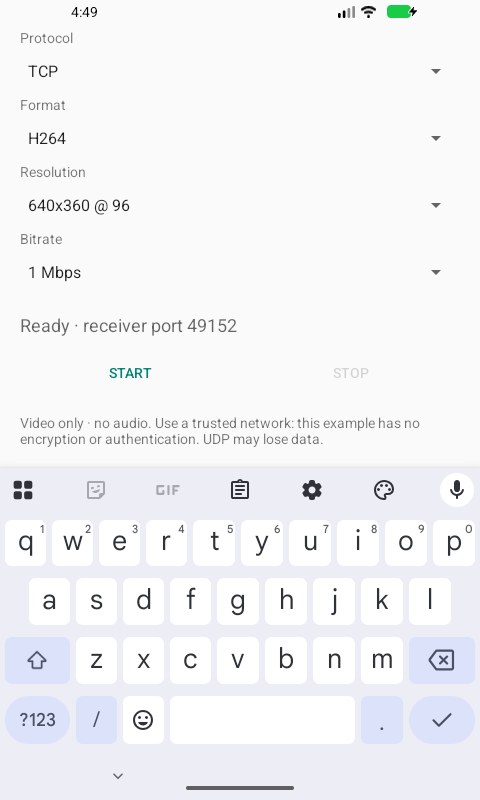

# Validation — 0.2.0

Observed on **2026-10-03**. This is a developer **debug APK**, versionName `0.2.0`, versionCode `2`, package `com.github.magicsih.androidscreencaster`, minSdk 21 / targetSdk 37. Support depends on a device encoder accepting the chosen MIME type, Surface input, size, and bitrate.

## Build and unit verification

- JDK 17, AGP 9.4.1, Gradle 9.8.0 with the pinned distribution SHA-256, SDK Platform 37.0 / Build Tools 36.0.0.
- A clean local build passed `assembleDebug testDebugUnitTest lintDebug assembleDebugAndroidTest` (77 tasks). **15 unit tests**, no failures, skips, or lint warnings.
- [Code PR #14](https://github.com/magicsih/AndroidScreenCaster/pull/14) passed [GitHub-hosted Linux CI](https://github.com/magicsih/AndroidScreenCaster/actions/runs/37107618768). CI builds the test APK; it does not execute emulator/device capture tests.
- Unit tests cover IVF header fields and 64-bit microsecond timestamps, buffer ranges, ordered initial/header delivery, connection/write failures, queued-video expiry, byte/packet caps including a blocked write, repeated close, worker termination, loopback TCP and legacy UDP fragmentation, and address validation.

## Actual screen transmission

The installed test APK displayed continuously moving shapes and an elapsed-time label, including after switching away from the sender UI. Each row ran for **125 seconds** after capture started, then stopped through the app and asserted that no `ScreenCaster-` capture/sender threads remained. FFmpeg decoded the video to per-frame hashes. Counts describe these runs, not a guaranteed frame rate or latency. All rows used 640×360 and the app's 1 Mbps setting.

| Environment | Transport / codec | Encoder | Decoded frames | Different frames | Different hashes in final 30 frames |
| --- | --- | --- | ---: | ---: | ---: |
| Seeker physical device, API 36 | TCP / H.264 | `c2.mtk.avc.encoder` | 3,204 | 3,194 | 30 |
| Seeker physical device, API 36 | TCP / VP8 | `c2.android.vp8.encoder` | 3,178 | 3,178 | 30 |
| Seeker physical device, API 36 | UDP / H.264 | `c2.mtk.avc.encoder` | 3,183 | 3,180 | 30 |
| Seeker physical device, API 36 | UDP / VP8 | `c2.android.vp8.encoder` | 3,183 | 3,183 | 30 |
| ARM64 emulator, API 34 | TCP / H.264 | `c2.android.avc.encoder` | 2,443 | 2,437 | 30 |
| ARM64 emulator, API 37 | TCP / H.264 | `c2.android.avc.encoder` | 1,961 | 1,961 | 30 |
| ARM64 emulator, API 21 | TCP / VP8 | `OMX.google.vp8.encoder` | 964 | 961 | 30 |

**Receiver details and limits:** macOS Homebrew FFmpeg was used. A macOS system service occupied TCP 49152, so TCP runs used the documented ADB reverse mapping to free local receiver ports. These are real TCP/FFmpeg decoding checks through that development route; direct Wi-Fi TCP was not separately measured.

UDP traveled over the physical device's LAN to a Python UDP socket bound to port 49152. The received datagrams were forwarded, unchanged and in arrival order, to FFmpeg's H.264/IVF stdin demuxer. The receiver observed 3,527 H.264 datagrams / 2,398,971 bytes, and 3,499 VP8 datagrams / 2,350,064 bytes. The VP8 first datagram began with `DKIF` with the microsecond time base. This verifies actual LAN UDP bytes and live FFmpeg decoding. **Direct FFmpeg/FFplay UDP socket playback on this Mac did not receive data and remains unverified**; its cause was not established. No firewall/system service was changed. The README commands follow FFmpeg's standard protocol syntax, but their direct UDP playback needs validation on the user's receiver environment.

The API 21 emulator launches and passes the UI smoke test. Its old H.264 software encoder only advertises low AVC levels and fails at the example's offered sizes; 800×480 also failed during encoder initialization. **H.264 capture on API 21 hardware remains unverified.** The API 21 format-query exception was fixed by choosing an encoder by MIME/Surface capability and configuring it directly. The example does not silently change the requested size/format or restart capture.

## Lifecycle and UI checks

| Check | Evidence / result |
| --- | --- |
| Launch, idle Start/Stop state, invalid URL input, scroll layout | Platform instrumentation passed on API 21, 34, 37 and the API 36 device |
| Consent denial and repeated Start while consent is pending | API 37: denial returned to Start with the denial message and no worker threads; instrumentation also invokes Start twice while pending |
| Stop and restart | Multiple independent device/emulator sessions stopped cleanly and requested a new visible consent dialog on the next Start; consent is never persisted |
| Other app / return to sender | Moving test Activity was captured in every 125-second run; API 37 returned to the sender with the sending state and Stop enabled |
| Rotation during capture | API 37 rotated to landscape and returned to portrait while the same capture session continued; output size stays fixed and may letterbox |
| System sharing Stop | API 37 system sharing chip → Stop sharing: controls reset and no worker threads remained |
| Screen lock | API 37 with its test lock screen enabled, then power/lock: system stopped capture, controls reset, no worker threads remained; no automatic restart |
| Foreground-notification Stop | API 34 notification Stop: controls reset and no worker threads remained |
| Bad hostname | API 34 `does-not-exist.invalid`: resolution error displayed and no worker threads remained |
| Receiver unavailable / closes | API 34 forwarded TCP with no receiver: broken-pipe error displayed and no worker threads remained; unit tests independently cover refused connection and write failure |
| Slow/stalled receiver | Unit tests verify bounded in-flight bytes/packets, expired video, unblock-on-close, and worker release; a physical-device stalled-reader soak was not run |
| Small screen / keyboard | API 37 at 480×800 / 160 dpi: inspected actual screen, opened keyboard, dragged the text area to reach Start/Stop; see image below |

## Reproduce and scope

See [CONTRIBUTING.md](../CONTRIBUTING.md) for installation, UI smoke, and `tools/device_qa.py` commands. The test requires manual approval of the visible Android screen-sharing dialog. Use `--seconds 125`, and a matching receiver route; inspect `summary.json`, `instrumentation.log`, `ffmpeg.log`, and `frames.md5`. A run passes only when changing frames arrive and capture threads terminate. Existing app data was not cleared or uninstalled.

This is not a full device fleet or every API/codec combination. Other resolutions, OEM encoders, Android API 21 hardware H.264, direct Wi-Fi TCP, direct Mac FFplay UDP playback, the physical device's lock behavior, long DNS stalls, and packet-loss/reordering recovery were not established. UDP has no recovery protocol, authentication, encryption, or delivery acknowledgment. No latency figure is claimed. Existing v0.1 artifacts are preserved and debug-signature compatibility is not promised.
